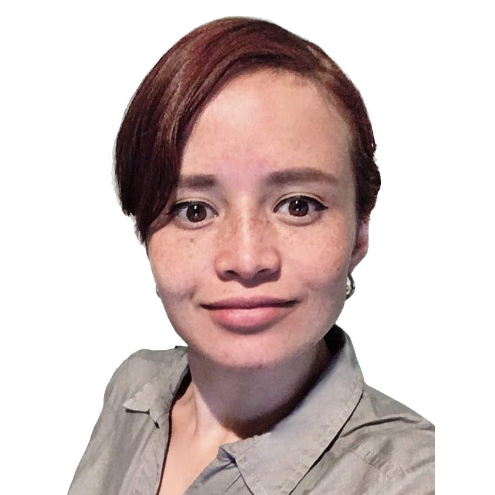
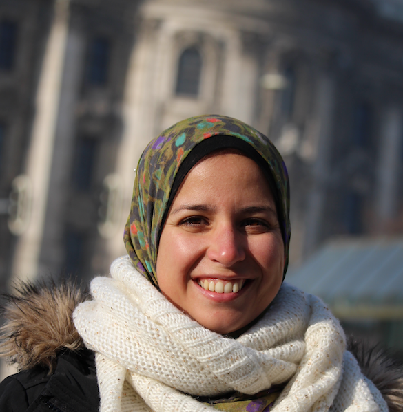

---
sidebar:
  - title: "Important Dates:"
    image_alt: "in the moment emotions."
    text: "Papers Deadline: 26-Feb-2021"
  - extra: ""
    text: "Papers Decisions: 7-Mar-2021"
  - extra: ""
    text: "Workshop: Sunday, 09-May-2021"
  - extra: ""
    text: "Time:   CET 14:00-18:15 (UTC+01:00)   JST 20:00-01:15 (next day)   EST 08:00-12:15"
  - extra: ""
    text: " "
  - extra: ""
    text: "Location: Virtual"
  - extra: ""
    text: "Contact: [aea@cwi.nl](mailto:aea@cwi.nl)"

layout: single
title: Organizers & Program Committee
---

<!--  -->
 

{:height="80px" width="80px"} &nbsp; **Abdallah El Ali**{:style="color: black"} - CWI, Amsterdam

Abdallah El Ali is a tenure-track researcher at the [Distributed & Interactive Systems](https://www.dis.cwi.nl/) group at [Centrum Wiskunde & Informatica (CWI)](https://www.cwi.nl/) in the Netherlands. His research focus is on temporal challenges in eliciting, capturing, and predicting human emotions, specifically on usable and effective emotion elicitation and annotation techniques across environments (VR/AR, mobile, wearables). Website: [https://abdoelali.com/](https://abdoelali.com/){:target="\_blank"}

---

{:height="80px" width="80px"} &nbsp; **Monica Perusquía-Hernández**{:style="color: black"} - NTT , Japan

Monica Perusquía-Hernández is a Research Associate at NTT Communication Science Laboratories, Japan. She is interested in affective computing and bio-signal processing. In particular, she works with sensing techniques such as Computer Vision, EMG and Skin Conductance for congruence estimation between facial expressions and emotions when assessing subjective user experience, time perception and affective awareness. Website: [https://www.monicaperusquia.com/](https://www.monicaperusquia.com/){:target="\_blank"}

---

{:height="80px" width="80px"} &nbsp;&nbsp; **Mariam Hassib**{:style="color: black"} - BU Munich, Germany

Mariam Hassib is a postdoctoral researcher at the Bundeswehr University Munich in Germany. Her research interests are Brain Computer Interfaces (BCI), and Physiological Computing. She is working on building systems which provide feedback and adapt to the cognitive and affective states of users. She leverages the current ubiquity of BCI devices and wearable physiological sensors to create new tools that support cognitive-awareness outside the lab environment.

---

{:height="80px" width="80px"} &nbsp;&nbsp; **Yomna Abdelrahman**{:style="color: black"} - BU Munich, Germany

Yomna Abdelrahman is a postdoctoral researcher at the Bundeswehr University Munich in Germany. Her research focuses on Thermal Imaging operating in the far-infrared spectrum, novel interactive systems, engagement sensing and adaptive bio-sensor assistive systems. Recently, her research focus shifted to affective computing using thermal cameras as unobtrusive sensor.

---

{:height="80px" width="80px"} &nbsp;&nbsp; **Joshua Newn**{:style="color: black"} - Uni Melbourne, Australia

Joshua Newn is a Postdoctoral Researcher in School of Computing and Information Systems at The University of Melbourne in Australia, where he specialises in the design, development and evaluation of Human-Centred AI. His research interests span across a wide range of areas, including the applications of novel inputs technologies to support human-AI interaction, multimodal sensing for cognition- and context-aware AI systems for health and learning applications, and the design and evaluation of explainable AI interfaces.
