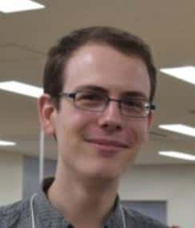

---
sidebar:
  - title: "Important Dates:"
    image_alt: "in the moment emotions."
    text: "Papers Deadline: X-May-2022"
  - extra: ""
    text: "Papers Decisions: X-Jun-2022"
  - extra: ""
    text: "Workshop: Someday, X-Oct-2022"
  - extra: ""
    text: "Time:   CEST XX:00-XX:00 (UTC+XX:00)   JST XX:00-XX:00   PDT XX:00-XX:00"
  - extra: ""
    text: " "
  - extra: ""
    text: "Location: Hybrid / Virtual"
  - extra: ""
    text: "Contact: [perusquia@ieee.org](mailto:perusquia@ieee.org)"

layout: single
title: Organizers & Program Committee
---

 

{:height="80px" width="80px"} &nbsp;&nbsp; **Yomna Abdelrahman**{:style="color: black"} - BU Munich, Germany

Yomna Abdelrahman is a Postdoctoral Researcher at the Bundeswehr University Munich in Germany. Her research focuses on Thermal Imaging operating in the far-infrared spectrum, novel interactive systems, engagement sensing and adaptive bio-sensor assistive systems. Recently, her research focus shifted to affective computing using thermal cameras as an unobtrusive sensor in the context of user-aware usable security. Website: [https://www.unibw.de/usable-security-and-privacy-en/team/dr-yomna-abdelrahman](https://www.unibw.de/usable-security-and-privacy-en/team/dr-yomna-abdelrahman){:target="\_blank"}

---

{:height="80px" width="80px"} &nbsp; **Lewis Chuang}**{:style="color: black"} - Chemnitz University of Technology, Germany

Monica Perusquía-Hernández is a Professor and holds the chair for "Humans and Technology" at the Chemnitz University for Technology, Germany. He received his PhD from the University of Tuebingen in behavioral neuroscience and employs task analyses, psychophysiology, psychophysics, and applied computational modeling to understand how humans interact with digital technologies and automation. He is on the executive board for the Engineering Psychology section of the German Society for Psychology and organized the Neuroergonomics Conference in 2021. Website: [https://lewischuang.com/](https://lewischuang.com/){:target="\_blank"}

---

{:height="80px" width="80px"} &nbsp; **Patricia Cornelio**{:style="color: black"} - Ultraleap, United Kingdom

Patricia Cornelio is a research engineer at Ultraleap where she coordinates a 4-year R\&D Future Leader Fellowship program. Patricia is interested in multisensory experiences with a focus on touch and smell using mid-air haptic technology, she is passionate about the human senses and the role they play in human-machine integration. Website: [https://patricia-cornelio.com/](https://patricia-cornelio.com/){:target="\_blank"}

---

{:height="80px" width="80px"} &nbsp; **Abdallah El Ali**{:style="color: black"} - CWI, Amsterdam

Abdallah El Ali is a research scientist at the [Distributed & Interactive Systems](https://www.dis.cwi.nl/) group at [Centrum Wiskunde & Informatica (CWI)](https://www.cwi.nl/) in the Netherlands. He is leading human-computer interaction (HCI) research with a focus on Affective Interactive Systems. His focus is on ground truth label acquisition techniques, affective state recognition and visualization across environments (mobile, wearable, XR), and bio-responsive interactive prototypes. Website: [https://abdoelali.com/](https://abdoelali.com/){:target="\_blank"}

---

{:height="80px" width="80px"} &nbsp; **Jeffrey Girard**{:style="color: black"} - University of Kansas, United States

Jeffrey Girard is an assistant professor at the University of Kansas in the department of psychology. He studies how emotions are expressed through verbal and nonverbal behaviour, as well as how interpersonal communication is influenced by individual differences (e.g., personality and mental health) and social factors (e.g., culture and context). His work draws insights and tools from various areas of social science, computer science, statistics, and medicine. Website: [https://jmgirard.com/](https://jmgirard.com/){:target="\_blank"}

---

{:height="80px" width="80px"} &nbsp; **Regan Mandryk**{:style="color: black"} - CWI, Amsterdam

Regan Mandryk is a  Professor and Tier 1 Canada Research Chair,
Digital Gaming Technologies and Experiences, at the Department of Computer Science, University of Saskatchewan, Canada. She earned her Bachelor of Science degree from the University of Winnipeg. She completed her Master's degree and PhD at Simon Fraser University in British Columbia. Her PhD dissertation applied physiological measures to model user emotion in interactive play environments. She then completed post-doctoral fellowships at the University of British Columbia and Dalhousie University. Website: [https://hci.usask.ca/](https://hci.usask.ca/){:target="\_blank"}

---

{:height="80px" width="80px"} &nbsp; **Monica Perusquía-Hernández**{:style="color: black"} - NAIST, Japan

Monica Perusquía-Hernández is an assistant professor at the Nara Institute of Science and Technology, and Visiting Researcher at NTT Communication Science Laboratories, Japan. She is interested in affective computing and bio-signal processing. In particular, she works with sensing techniques such as Computer Vision, EMG and Skin Conductance for congruence estimation between facial expressions and emotions when assessing subjective user experience, time perception and affective awareness. Website: [https://www.monicaperusquia.com/](https://www.monicaperusquia.com/){:target="\_blank"}

---

{:height="80px" width="80px"} &nbsp; **Johannes Schirm**{:style="color: black"} - NAIST, Japan

Johannes Schirm is a Ph.D. candidate at the Nara Institute of Science and Technology, Japan. After studying applied computer science and graphics with a focus on video games, he specialised on virtual reality research. Currently, he examines physiological data like eye tracking, EMG and head movements for their potential of more objectively evaluating the illusion of "presence" in virtual reality, a quale which is most commonly assessed using questionnaires only. Website: [https://johannes-schirm.de/](https://johannes-schirm.de/){:target="\_blank"}

---

{:height="80px" width="80px"} &nbsp; **Mohammad Soleymani**{:style="color: black"} - USC, United States

Mohammad Soleymani is a research assistant professor with the USC Institute for Creative Technologies. He received his PhD in computer science from the University of Geneva in 2011. From 2012 to 2014, he was a Marie Curie fellow at Imperial College London. He was a research scientist at the Swiss Center for Affective Sciences, University of Geneva. His main line of research involves developing automatic emotion recognition and behaviour understanding methods using physiological signals and facial expressions. He is also interested in understanding subjective attributes in multimedia content, e.g., predicting whether an image is interesting from its pixels or automatic recognition of music mood from acoustic content. Website: [https://ict.usc.edu/about-us/leadership/research-leadership/mohammad-soleymani/](https://ict.usc.edu/about-us/leadership/research-leadership/mohammad-soleymani/){:target="\_blank"}

---
